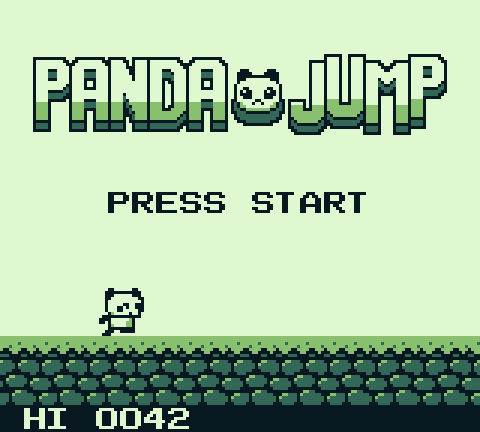
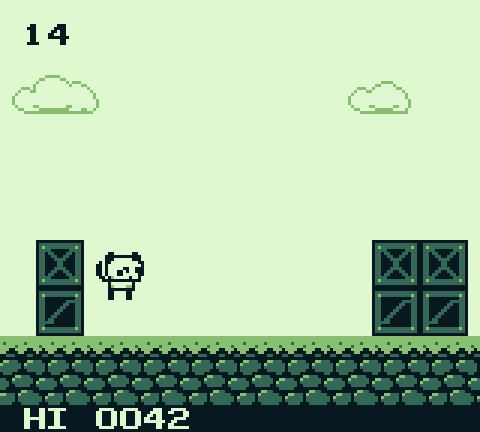
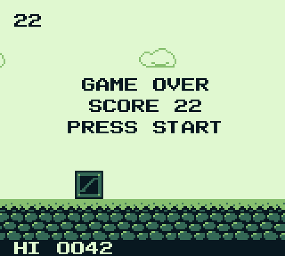
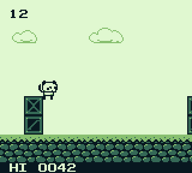

# PandaJump for Game Boy

A panda runs, you jump. PandaJump is a one-button endless runner for the
original Game Boy, in the spirit of Flappy Bird: tap A to hop the panda over
columns of crates, tap again in the air for a double jump, and see how far
you get. It's a port of [PandaJump](https://github.com/maxh213/PandaJump)
(2014, Phaser), rebuilt the traditional way: C compiled with GBDK-2020 into
a real `.gb` ROM, with hand-pixelled 4-shade art, hardware scrolling,
raster-split parallax and a battery-backed high score. The same ROM plays in
a web browser through a bundled emulator.

  



## Play it

- **In a browser:** the game is at
  <https://maxh213.github.io/pandajump-gameboy/>. To play locally, serve
  the `web/` folder (the ROM is committed there) with
  `python3 -m http.server -d web 8000` and open <http://localhost:8000/>;
  after changing the game, run `make web` first. Keyboard, gamepad and touch all work, and the
  high score is kept in the browser.
- **In an emulator:** download [`web/pandajump.gb`](web/pandajump.gb) and
  open it in mGBA, SameBoy, Emulicious, BGB or any other Game Boy emulator.
- **On a real Game Boy:** the ROM is a 32 KiB MBC5 cartridge with 8 KiB of
  battery-backed RAM, so it runs from any flash cart that supports MBC5 and
  keeps your high score.

## Controls

| Game Boy | Keyboard (web) | What it does |
|----------|----------------|--------------|
| A | Z, Space, W or Up | Jump; press again in the air to double jump. Also starts a run and restarts after game over |
| Start | Enter | Start a run, pause and resume, restart after game over |
| Select | C or Backspace | On the title screen, turn the music off or on |

On a phone, tap the on-screen A button or the screen itself to jump.

## How it plays

- The panda runs at a steady pace and crates scroll in from the right, one
  or two high. After 10 points some come as double-wide columns; the tall
  ones are easiest with the double jump.
- You score a point for every column you clear. Touch a crate and it's game
  over. When PRESS START appears, about a second later, press Start or A
  to go again.
- The game speeds up every 5 points until score 40, then keeps getting
  harder with more double and tall columns up to score 80. Every obstacle
  sequence it can generate is clearable, with room for presses a few frames
  early or late; `src/config.h` has the derivation and the tests check it.
- Pressing A a moment before landing still jumps (a short jump buffer), and
  an early second tap never cuts a jump short.
- Your best score is saved on the cartridge and shown at the bottom of the
  screen.

## Build it

You need `make`, [GBDK-2020](https://github.com/gbdk-2020/gbdk-2020) 4.5.x,
and Python 3 for the tests and art tools.

```sh
tools/get-gbdk.sh                    # download GBDK-2020 4.5.0 into tools/gbdk (or install the gbdk-2020 AUR package)
make                                 # build build/pandajump.gb
make run                             # play it in mGBA (set MGBA=... for another emulator)
python3 -m venv .venv                # Debian/Ubuntu: apt install python3-venv first
.venv/bin/pip install -r requirements-dev.txt   # PyBoy, Pillow, numpy, pytest
make test                            # 220 headless tests, under a minute
make web                             # copy the ROM into web/ for the browser player
```

The Makefile uses `.venv/bin/python3` when that virtualenv exists (set
`PYTHON=...` to use another Python).

Other targets: `make art` regenerates `art/*.png` from `tools/make_art.py`,
`make art-check` checks they match, and `make DEBUG=1` builds with debug
information for Emulicious into `build/debug/`. `make web-test` runs the
browser smoke test; it needs Node 18+ and a one-time
`cd web/tests && npm ci && npx playwright install chromium` (see
[`web/README.md`](web/README.md#test)). The Makefile finds GBDK in
`tools/gbdk` or `/opt/gbdk`; pass `GBDK_HOME=/path/to/gbdk/` to use another
install.

`make run` plays a copy of the ROM from `play/`, so mGBA's save (your high
score) survives `make clean`.

## How it works

| Part | Where | Notes |
|------|-------|-------|
| State machine | `src/main.c` | Title, play, pause and game over. The game reads the joypad right after VBlank and runs its logic once per frame. |
| World | `src/world.c` | The ground scrolls with the `SCX` register. New crate columns are written into the tile map just off-screen, and `col_height[]` mirrors them for tile-based collision. An LYC interrupt splits the screen into three bands: a static score bar, a slow sky with drifting, bobbing clouds, and the fast world. |
| Panda | `src/player.c` | 8.8 fixed-point physics, the double jump, the jump buffer, animation and dust puffs. The panda is a 16×16 metasprite. |
| HUD | `src/hud.c` | Score in the background map, high score in the window, `SCORE` / `NEW BEST!` and `PAUSED` as background text, and `GAME OVER` / `PRESS START` as sprite text. |
| Save | `src/save.c` | Two checksummed slots in cartridge RAM with a sequence number, so a power cut mid-save can't lose the old best. |
| Sound | `src/sound.c` | A small table-driven driver: effects on channels 1 and 4, and two looping tunes on channels 2 and 3. |
| Art | `tools/make_art.py` → `art/*.png` → `png2asset` | Every sprite and tile is drawn by hand as a text grid in the script, which writes 4-colour PNGs. The build converts them with `png2asset`. Edit the script, not the PNGs. `tools/preview_art.py` renders previews and mock screens. |
| Tuning | `src/config.h` | Every gameplay constant, with the fairness derivation. |
| Web player | `web/` | [binjgb](https://github.com/binji/binjgb) (WebAssembly) plus a small player script: exact integer scaling, Web Audio, keyboard, gamepad and touch, and the battery save kept in `localStorage`. See [`web/README.md`](web/README.md). |

[`docs/DESIGN.md`](docs/DESIGN.md) is the full design: screen layout, tile
and sprite allocation, palette, save format and the variables the tests read.
[`PROMPT.md`](PROMPT.md) is the original brief.

## Tests

`make test` runs the ROM headless in [PyBoy](https://github.com/Baekalfen/PyBoy)
and checks it against an independent model of the rules in `tests/model.py`.
It covers the ROM header and art contract, physics frame for frame,
collision, scoring, the obstacle generator over thousands of columns, an
autoplayer and a deliberately sloppy player surviving the difficulty ramp,
pause, the save format including torn writes and power cycles, the HUD,
parallax bands, frame timing and sound. See [`tests/README.md`](tests/README.md).

`web/tests/smoke.js` drives the browser player in Chromium with Playwright:
input reaching the game, sound, saves across reloads and tabs, phone layouts
and pixel-exact scaling.

## Continuous integration

[`.github/workflows/build.yml`](.github/workflows/build.yml) runs on every
push and pull request. It checks `art/*.png` match `tools/make_art.py`,
builds the ROM and checks the committed `web/pandajump.gb` matches it, runs
the headless test suite and uploads the ROM, then runs the browser smoke
test in `web/tests/` against it. On a push to `main`, once all of that has
passed, it publishes `web/` (without its tests) to GitHub Pages at
<https://maxh213.github.io/pandajump-gameboy/>. The repository's Pages
source is set to GitHub Actions.

## Layout

```
.github/    GitHub Actions workflow: build, test, and deploy web/ to Pages
art/        4-colour source PNGs (generated by tools/make_art.py)
docs/       DESIGN.md and screenshots
src/        the game (C, GBDK-2020)
tests/      PyBoy test suite
tools/      art scripts, rom_shot.py (headless screenshots), get-gbdk.sh
web/        browser player, bundled emulator, and the built ROM
```

## Credits

- Original PandaJump by [maxh213](https://github.com/maxh213).
- [GBDK-2020](https://github.com/gbdk-2020/gbdk-2020) and SDCC build the
  ROM. GBDK's library is GPLv2 with a linking exception, so linking it
  doesn't put the game under the GPL.
- [binjgb](https://github.com/binji/binjgb) by Ben Smith (MIT) runs the game
  in the browser; its licence is in `web/vendor/LICENSE`.
